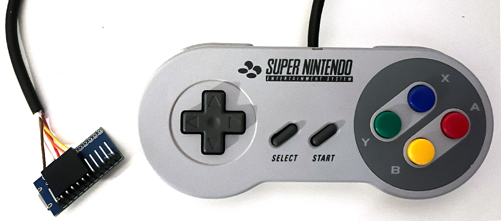
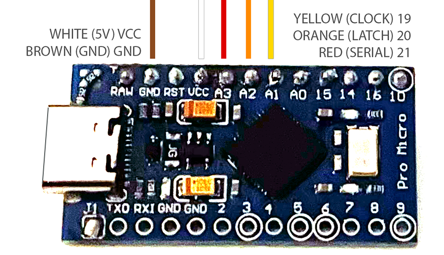

# USB SNES Controller for Analogue Pocket Dock

I wanted to use my original SNES controllers with the Analogue Pocket Dock for that authentic retro feel. However, finding compatible controllers isn’t as simple as it seems - especially when you want to use adapters for the original controllers. While there are solutions within the MiSTer community (see links below), none of them really suited my needs: I wanted something slim!

As a first step, I implemented the necessary library and soldered the headers onto an Arduino Pro Micro. After cutting off the connector from an original SNES controller, I added a cable connector at the end. With the right USB-C cable (not all work), the controller can now be plugged directly into the Dock.

Next, I plan to integrate the Arduino Pro Micro into an SNES controller extension socket, so original controllers can be used with the Dock without having to modify or damage them.

## Introduction
This project allows you to connect a Super Nintendo (SNES) controller via USB to the Analogue Dock using an Arduino Pro Micro flashed with a special XInput firmware. In addition to direct input, the controller can also be programmed to perform various advanced functions:

1. **Autofire**: Press `Select` + any other button to enable autofire while the button is held down. To disable autofire, press `Select` + the same button again.
2. **Programming Button Sequences**: You can program a sequence of button presses by double-clicking `Select`. The LED will turn red, indicating that the controller is in programming mode. After this, press any sequence of buttons.
   - **To save the sequence**, double-click `Select` again, which turns off the LED and ends programming. The programmed sequence can be played back by pressing `Select` once.
   - Alternatively, hold `Select` for about 3 seconds, and the recorded sequence will be saved and afterwards **played back in a loop** for as long as `Select` is held down.
3. **Clearing the Program**: To clear the programmed sequence, double-click `Select`, then after a short pause, double-click `Select` again.
4. **Emulating the Logo Button**: Analogue has already implemented the emulation of the Xbox controller's logo button in the Pocket's OS: Press `D-Pad Down` and `Select` together. However (or in case you want to use the controller on any other xinput capable platform), it can natively be emulated by pressing `Select` + `Start` simultaneously. This achieves the same result.
5. **Disabling Extra Functions**: If you want to use the controller without any extra functions, you can disable them by holding `Select` for 5 seconds within 30 seconds of connecting the controller.

### Important Notes:
- **Not all Arduino boards are compatible**: Ensure you are using an Arduino Pro Micro or a similar board that supports XInput and has sufficient USB support. Boards without proper USB HID support may not work correctly with this project.
- **Hardware Considerations**: Double-check the pin assignments and wiring for your specific setup. Ensure that the controller is properly grounded and powered, and be mindful of the pull-up resistors that are needed for certain data pins.

### Special Thanks:
This project was inspired by and built upon the work of several amazing developers and open-source projects. Special thanks to the following authors for their contributions to the SNES controller and Arduino communities:

- [ArduinoXInput by dmadison](https://github.com/dmadison/ArduinoXInput): This project provides an XInput implementation for Arduino boards, enabling controllers to be recognized as Xbox controllers on PCs and consoles.
- [Arduino-SNES-Controller by burks10](https://github.com/burks10/Arduino-SNES-Controller): A project that demonstrates how to connect an SNES controller to an Arduino, serving as a foundational resource for this project.
- [SNESpad by RobertDaleSmith](https://github.com/RobertDaleSmith/SNESpad): A detailed guide and codebase for interfacing with SNES controllers on modern hardware using Arduino.
- [DaemonBite-Retro-Controllers-USB by MickGyver](https://github.com/MickGyver/DaemonBite-Retro-Controllers-USB/tree/master/SNESControllersUSB): This project allows retro controllers, including the SNES controller, to be connected to USB hosts, offering a robust and efficient solution for retro gaming setups.

---

## Implementation
This project enables interaction with an SNES controller using a microcontroller (e.g., Arduino). It includes functionality for querying and processing button inputs, as well as recording and playback of these inputs. The project consists of several classes that handle different aspects of controller interaction, button state management, and input recording.

---

## How to Use



1. **Setup**: Connect the SNES controller wires to the specified pins (`GND/brown`, `VCC/white`, `CLOCK/red`, `LATCH/orange`, `DATA/yellow`) on your microcontroller.
2. Install [Arduino XInput-Library](https://github.com/dmadison/ArduinoXInput)
3. Install [Arduino DebugUtils-Library](https://github.com/arduino-libraries/Arduino_DebugUtils)
4. **Upload the Sketch**: Compile source and upload to your Arduino-compatible microcontroller.

If you want to compile it, keep in mind to first switch the firmware to "`Arduino [...] w/ XInput`" (according to your board - in my case ... is Leonardo). When the firmware is installed, the board acts as a controller and cannot be seen by Arduino IDE. To make it visible you have to bridge the reset PIN - Its between `GND` and `VCC`.

---

The project can be customized to suit your own preferences, particularly through modifying specific constants in the code. Below are some key areas where changes can be made:

### 1. Autofire Mode Button
The button used to activate autofire mode is defined in `SNESController.h`:

```cpp
#define AUTOFIRE_BUTTON             SNES_SELECT
```
If you want to use a different button to trigger autofire mode, you can use any other of this constants:

```plaintext
- SNES_START    
- SNES_SELECT   
- SNES_UP       
- SNES_DOWN     
- SNES_LEFT     
- SNES_RIGHT    
- SNES_A        
- SNES_B        
- SNES_X        
- SNES_Y        
- SNES_L        
- SNES_R        
```

### 2. Button Sequence Programming
The number of clicks (double clicks by default) required to initiate or save a button sequence is defined here:

```cpp
#define PROGRAM_BUTTON_REC_CLICKS   2
#define PROGRAM_BUTTON_SAVE_CLICKS  2
```

If you prefer a different number of clicks to start or save a sequence, you can adjust these constants.

### 3. Timeout Settings
The project also includes several timeout-related constants that control behavior, such as the timeout for multi-click detection or how long a button needs to be held to trigger an action. These can be found in `SNESController.h`:

```cpp
// Number of seconds to hold Select to deactivate functions
#define DEACTIVATION_BUTTON_TIME    5   

// Time window to deactivate mods after power on
#define DEACTIVATION_TIME_WINDOW    30  

// Minimum time to hold button for continuous playback
#define CONTINUOUS_BUTTON_TIME      3   
```
You can modify these time values to change how long buttons need to be held or how quickly actions are triggered.

By adjusting these constants, you can tailor the behavior of the controller to your specific needs, whether that involves changing button functionality, adjusting input timings, or modifying the sequence recording process.

### 4. Switch A/B

On some platforms the logic of A/B is switched (XBox, Playstation, etc.). If you want to use the adapter for another platform and you need to switch A and B buttons, go to `apd_snes.ino` and replace

```cpp
// A/B Buttons are not switched
SNESController snesController = SNESController(REGULAR_AB);
```

with 

```cpp
// A/B Buttons will be switched
SNESController snesController = SNESController(SWITCH_AB);
```

---

## Files and Classes

### 1. `ControllerButton.h` / `ControllerButton.cpp`
These files define and implement the `ControllerButton` class, which manages the state of individual controller buttons. The class tracks button presses, releases, holds, and changes, as well as handling different modes such as normal and autofire.

#### Key Methods:
- **`updateInput(bool state)`**: Updates the button state (pressed, released, held) and manages multi-clicks.
- **`toggleMode()`**: Switches between normal mode and autofire mode.
- **`process()`**: Processes the button input according to the current mode.
- **`reset()`**: Resets the button's internal state.

### 2. `SNESController.h` / `SNESController.cpp`
This class is responsible for interfacing with the SNES controller. It inherits from `GameConsoleController` and provides specific implementations for SNES hardware interaction, such as fetching button states and handling controller pins.

#### Key Methods:
- **`setup()`**: Initializes the SNES controller hardware pins and sets up the connection.
- **`preFetch()`, `fetch()`, `postFetch()`**: These methods handle the process of querying the controller and updating the button states.
- **`get(int id)` / `set(int id, ControllerButton buttonUpdate)`**: Retrieves and sets the state of a specific button.

### 3. `GameConsoleController.h` / `GameConsoleController.cpp`
This is a base class for console controllers. It provides generic methods for setting up the controller and fetching data, which can be extended by specific implementations (such as the SNES controller).

### 4. `ButtonPressRecorder.h` / `ButtonPressRecorder.cpp`
The `ButtonPressRecorder` class is responsible for recording button inputs and playing them back. This is useful for automating sequences of button presses or for testing purposes.

#### Key Methods:
- **`startRecording()` / `endRecording()`**: Starts and ends the recording of button presses.
- **`record(int button)`**: Records a button press during an active recording session.
- **`startPlayback()` / `playback()`**: Starts and handles the playback of recorded button presses.

### 5. `apd_snes.ino`
This Arduino sketch manages the overall controller operation. It uses the `SNESController` class to fetch button states and handle controller input in a loop.

#### Key Functions:
- **`setup()`**: Initializes the SNES controller and sets up debugging via the serial interface.
- **`loop()`**: Continuously fetches the controller state and handles input processing.

---

## License

MIT License

Copyright (c) 2024 Tim Böttiger

Permission is hereby granted, free of charge, to any person obtaining a copy
of this software and associated documentation files (the "Software"), to deal
in the Software without restriction, including without limitation the rights
to use, copy, modify, merge, publish, distribute, sublicense, and/or sell
copies of the Software, and to permit persons to whom the Software is
furnished to do so, subject to the following conditions:

The above copyright notice and this permission notice shall be included in all
copies or substantial portions of the Software.

THE SOFTWARE IS PROVIDED "AS IS", WITHOUT WARRANTY OF ANY KIND, EXPRESS OR
IMPLIED, INCLUDING BUT NOT LIMITED TO THE WARRANTIES OF MERCHANTABILITY,
FITNESS FOR A PARTICULAR PURPOSE AND NONINFRINGEMENT. IN NO EVENT SHALL THE
AUTHORS OR COPYRIGHT HOLDERS BE LIABLE FOR ANY CLAIM, DAMAGES OR OTHER
LIABILITY, WHETHER IN AN ACTION OF CONTRACT, TORT OR OTHERWISE, ARISING FROM,
OUT OF OR IN CONNECTION WITH THE SOFTWARE OR THE USE OR OTHER DEALINGS IN THE
SOFTWARE.
